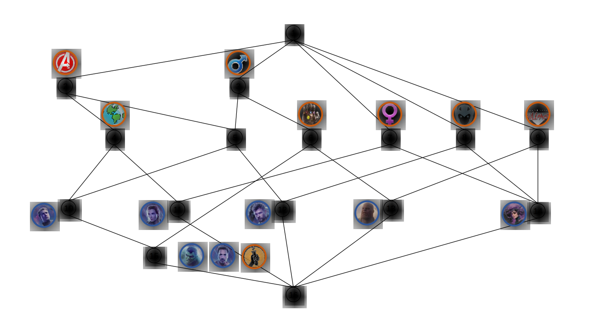

FCA-Map: Identifying Mappings by Formal Concept Analysis
========================================================

[](LICENSE)


> Ontology matching system based on formal concept analysis.

Formal concept analysis (FCA) is a well developed mathematical model for analyzing data and structuring concepts.

## Table of Contents

- [Background](#background)
- [Install](#install)
- [Usage](#usage)
- [Contributing](#contributing)
- [References](#references)
- [License](#license)

## Background

Formal Concept Analysis is based on mathematical order theory, in particular on the theory of complete lattices (See the [book](https://www.springer.com/gp/book/9783540627715)). The following is an example of formal concept analysis. 

### Formal Context

|                        | ![Human][hm] <br /> Human | ![Male][ml] <br /> Male | ![Female][fml] <br /> Female | ![Scientist][sci] <br /> Scientist | ![Avenger][ag] <br /> Avenger | ![Villain][vln] <br /> Villain | ![Asgardian][asg] <br /> Asgardian | ![Infinity Stones User][inf] <br /> Infinity Stones User |
|:----------------------:|:-:|:-:|:-:|:-:|:-:|:-:|:-:|:-:|
|    ![Iron Man][im]     | ✖️ | ✖️ |   | ✖️ | ✖️ |   |   | ✖️ |
|      ![Thor][tr]       |   | ✖️ |   |   | ✖️ |   | ✖️ |   |
|   ![Black Widow][bw]   | ✖️ |   | ✖️ |   | ✖️ |   |   |   |
|      ![Hulk][hk]       | ✖️ | ✖️ |   | ✖️ | ✖️ |   |   | ✖️ |
| ![Captain America][ca] | ✖️ | ✖️ |   |   | ✖️ |   |   |   |
|     ![Thanos][ts]      |   | ✖️ |   |   |   | ✖️ |   | ✖️ |
|      ![Hela][hl]       |   |   | ✖️ |   |   | ✖️ | ✖️ |   |

### Concept Lattices (derived from the above context)



## Install

This program depends upon:
- Maven 3.6.1
- Jena 3.12.0
- Java 1.8.0\_161

It is developed using [IntelliJ IDEA](https://www.jetbrains.com/idea/). (Recommended)

## Usage

```java
// Demo.java

import cn.amss.semanticweb.alignment.Mapping;
import cn.amss.semanticweb.model.OntModelWrapper;
import cn.amss.semanticweb.matching.LexicalMatcher;
import cn.amss.semanticweb.matching.MatcherFactory;

public class Demo {
  public static void main(String[] args) {
    String srcURL = "http://oaei.ontologymatching.org/2019/conference/data/Conference.owl";
    String tgtURL = "http://oaei.ontologymatching.org/2019/conference/data/ekaw.owl";

    OntModelWrapper source = new OntModelWrapper(srcURL);
    OntModelWrapper target = new OntModelWrapper(tgtURL);

    LexicalMatcher lm = MatcherFactory.createLexicalMatcher();
    lm.setExtractType(true, true);

    Mapping mappings = new Mapping();

    lm.setSourceOntModelWrapper(source);
    lm.setTargetOntModelWrapper(target);

    lm.mapOntClasses(mappings);
    lm.mapDatatypeProperties(mappings);
    lm.mapObjectProperties(mappings);

    System.out.println(mappings);
  }
}
```

## Contributing

See [the contributing file](CONTRIBUTING.md).

PRs accepted.

### FCA-Map for matching biomedical ontologies

See [FCA-Map@liweizhuo001](https://github.com/liweizhuo001/FCA-Map) (**no longer maintaining**), which system is primarily developed by _Mengyi Zhao_.

## Acknowledgements

This work has been supported by the National Key Research and Development Program of China under grant 2016YFB1000902, and the Natural Science Foundation of China grant 61621003.

## References

1. **Identifying Mappings among Knowledge Graphs by Formal Concept Analysis.** _Guowei Chen, Songmao Zhang._ OM@ISWC 2019: . [[paper][1]]

2. **FCAMapX results for OAEI 2018.** _Guowei Chen, Songmao Zhang._ OM@ISWC 2018: 160-166. [[paper][2]]

3. **Matching biomedical ontologies based on formal concept analysis.** _Mengyi Zhao, Songmao Zhang, Weizhuo Li, Guowei Chen._ J. Biomedical Semantics 9(1): 11:1-11:27 (2018). [[paper][3]]

## Maintainer

[@icgw](https://github.com/icgw)

## License

[GPLv3](LICENSE) © Guowei Chen

[im]: .assets/iron-man.png
[tr]: .assets/thor.png
[bw]: .assets/black-widow.png
[hk]: .assets/hulk.png
[ca]: .assets/captain-america.png
[ts]: .assets/thanos.png
[hl]: .assets/hela.png
[hm]: .assets/human.png
[ml]: .assets/male.png
[fml]: .assets/female.png
[sci]: .assets/scientist.png
[ag]: .assets/avenger.png
[vln]: .assets/villain.png
[asg]: .assets/asgardian.png
[inf]: .assets/infinity.png
[1]: http://disi.unitn.it/~pavel/om2019/papers/om2019\_LTpaper3.pdf
[2]: http://ceur-ws.org/Vol-2288/oaei18\_paper7.pdf
[3]: https://jbiomedsem.biomedcentral.com/articles/10.1186/s13326-018-0178-9
