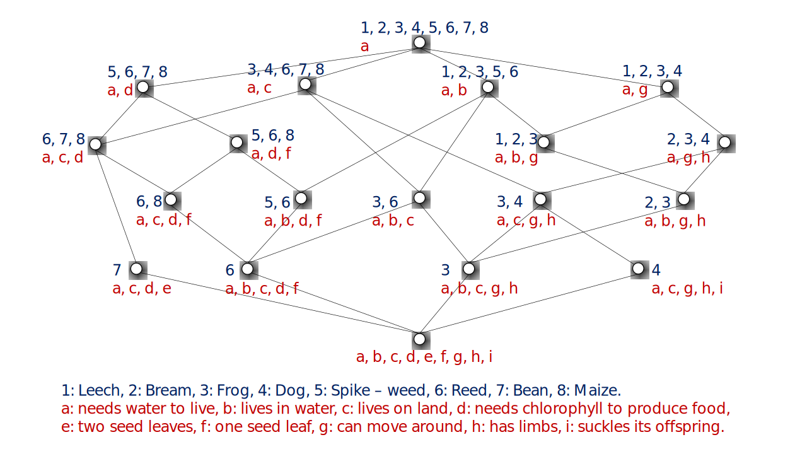

FCA-Map: Mapping ontologies by formal concept analysis
======================================================

[](LICENSE)


> Ontology matching system based on formal concept analysis.

Formal concept analysis (FCA) is a well developed mathematical model for analyzing data and structuring concepts.

## Table of Contents

- [Background](#background)
- [Install](#install)
- [Usage](#usage)
- [Contributing](#contributing)
- [Reference](#reference)
- [License](#license)

## Background

Formal Concept Analysis is based on mathematical order theory, in particular on the theory of complete lattices (See the [book](https://www.springer.com/gp/book/9783540627715)). The following is an example of formal concept analysis. 

### Formal Context

|               | needs water to live | lives in water | lives on land | needs chlorophyll to produce food | two seed leaves | one seed leaf | can move around | has limbs | suckles its offspring |
|:-------------:|:-------------------:|:--------------:|:-------------:|:---------------------------------:|:---------------:|:-------------:|:---------------:|:---------:|:---------------------:|
|     Leech     |          ✖          |       ✖        |               |                                   |                 |               |        ✖        |           |                       |
|     Bream     |          ✖          |       ✖        |               |                                   |                 |               |        ✖        |     ✖     |                       |
|     Frog      |          ✖          |       ✖        |       ✖       |                                   |                 |               |        ✖        |     ✖     |                       |
|      Dog      |          ✖          |                |       ✖       |                                   |                 |               |        ✖        |     ✖     |           ✖           |
| Spike -- weed |          ✖          |       ✖        |               |                 ✖                 |                 |       ✖       |                 |           |                       |
|     Reed      |          ✖          |       ✖        |       ✖       |                 ✖                 |                 |       ✖       |                 |           |                       |
|     Bean      |          ✖          |                |       ✖       |                 ✖                 |        ✖        |               |                 |           |                       |
|     Maize     |          ✖          |                |       ✖       |                 ✖                 |                 |       ✖       |                 |           |                       |

### Concept Lattices (derived from the above context)



## Install

This module depends upon:
- Maven 3.6.1
- Jena 3.12.0
- Java 1.8.0\_161

This program is developed using [IntelliJ IDEA](https://www.jetbrains.com/idea/). (Recommended)

## Usage

```
```

## Contributing

See [the contributing file](CONTRIBUTING.md).

PRs accepted.

### FCA-Map for matching biomedical ontologies

See [FCA-Map@liweizhuo001](https://github.com/liweizhuo001/FCA-Map) (**no longer maintaining**), which system is primarily developed by _Mengyi Zhao_.

## Acknowledgements

This work has been supported by the National Key Research and Development Program of China under grant 2016YFB1000902, and the Natural Science Foundation of China grant 61621003.

## References

1. **Identifying Mappings among Knowledge Graphs by Formal Concept Analysis.** _Guowei Chen, Songmao Zhang._ OM@ISWC 2019: . [[paper](http://disi.unitn.it/~pavel/om2019/papers/om2019_LTpaper3.pdf)]

2. **FCAMapX results for OAEI 2018.** _Guowei Chen, Songmao Zhang._ OM@ISWC 2018: 160-166. [[paper](http://ceur-ws.org/Vol-2288/oaei18_paper7.pdf)]

3. **Matching biomedical ontologies based on formal concept analysis.** _Mengyi Zhao, Songmao Zhang, Weizhuo Li, Guowei Chen._ J. Biomedical Semantics 9(1): 11:1-11:27 (2018). [[paper](https://jbiomedsem.biomedcentral.com/articles/10.1186/s13326-018-0178-9)]

## Maintainer

[@icgw](https://github.com/icgw)

## License

[GPLv3](LICENSE) © Guowei Chen
